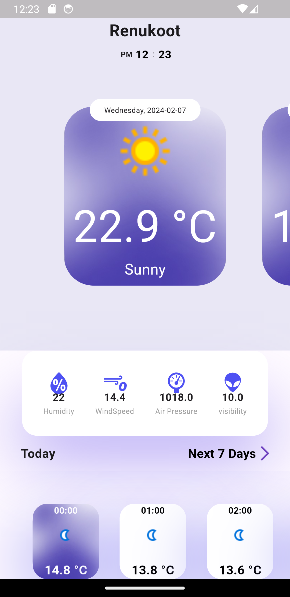
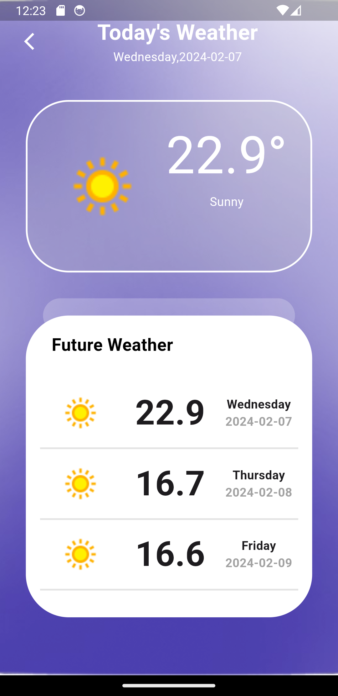

# Weather App in Flutter

## Overview

This Flutter weather app provides real-time weather information based on user's location. It offers a clean and intuitive interface for users to check current weather conditions, forecasts, and more.

# API- [weatherapi](''https://weatherapi.com]')

## Weather API Integration

This weather app relies on a Weather API to fetch real-time weather data. We've integrated a powerful API to provide accurate and up-to-date information. If you'd like to use this app or contribute to its development, you'll need to obtain an API key and configure it in the project.

### Obtaining an API Key

To get started, follow these steps:

1. **Sign up for an API Key:**

   Visit the website of the Weather API provider and sign up for an account. Once registered, you should be able to generate an API key from your account dashboard.

2. **Configure the API Key:**

   Once you have your API key, open the project and locate the configuration file where API keys are stored. Typically, this file is named `main.dart` or similar. Replace the placeholder `YOUR_API_KEY_HERE` with the actual API key you obtained.

   Example:

   ```dart
   // lib/main.dart

      const String APIKEY = 'YOUR_API_KEY_HERE';  
## Features

- **Real-time Weather Data:** The app fetches the latest weather information to provide accurate and up-to-date conditions.

- **Location-based:** Utilizes the device's location to display weather data specific to the user's area.

- **Forecast:** Displays a detailed weather forecast for the upcoming days.

- **Responsive Design:** Ensures a seamless experience across various screen sizes and orientations.

## Screenshots

Explore the visual aspects of the Weather App through the following screenshots. These images provide a sneak peek into the app's user interface and features.

<div align='center'>




</div>

## Installation

To run this app locally, follow these steps:

1. **Clone the repository:**

   ```bash
   git clone https://github.com/your-username/weather-app-flutter.git

2. **Change into the project directory:**
    ```bash
    cd weather-app-flutter

3. **Install dependencies:**
    ```bash
    flutter pub get
4. **Run the app:**
    ```bash
    flutter run
## Dependencies

This project relies on the following external packages and libraries. Make sure to include them in your project's dependencies.

- [**Bloc**](https://pub.dev/packages/bloc): State management for Flutter.
 

- [**http**](https://pub.dev/packages/http): HTTP requests and responses.
 

- [**geolocator**](https://pub.dev/packages/geolocator): Provides easy access to the device's location.
  

## Usage
Describe how users can interact with your app. Include any configuration settings or special instructions

## Contributions
If you'd like to contribute to the project, please follow these steps:

1. Fork the repository.
2. Create a new branch: 
    `git checkout -b . feature/new-feature`.
3. Make your changes and commit them: `git 4. commit -m 'Add new feature'`.
5. Push to the branch: `git push origin feature/new-feature`.
6. Create a pull request.

# [Download it ]('https://drive.google.com/file/d/1q7sBxIRyduF6klfzoH47mId_ygRjSLZr/view?usp=sharing')
<div align='center'>


</div>
